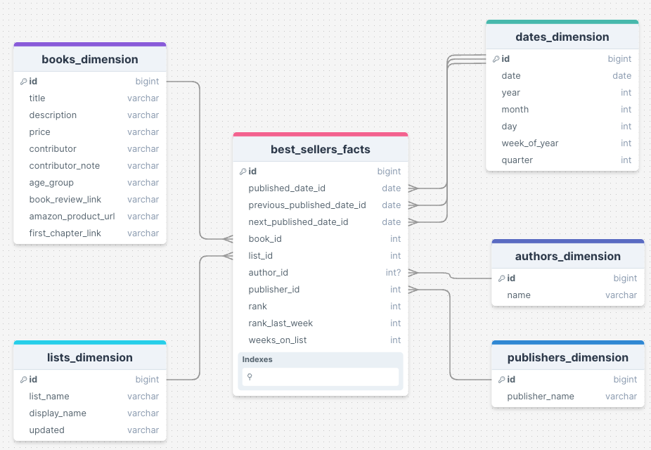

# nyt-books-elt

## Overview

This documentation provides detailed instructions on setting up and running a Docker container to retrieve, store, and query data from the New York Times Books API, specifically focusing on the lists overview endpoint. The tasks include data retrieval for the years 2021 to 2023, dimensional modeling, and executing specific SQL queries to generate insights and export results.

## Pre-requisites

- Docker and Docker Compose installed on your machine.
- A New York Times API key. You can request one [here](https://developer.nytimes.com/get-started).

## Docker Compose File

The Docker Compose file defines a single service nyt-elt which is responsible for the entire ELT (Extract, Load, Transform) process.

```yaml
version: '3.8'
services:
  nyt-elt:
    build:
      context: .
      dockerfile: Dockerfile
    image: nyt-books-app
    container_name: nyt-elt
    volumes:
      - ./core/sql_queries/docker_results:/app/core/sql_queries/results
      - ./output_db:/app/output_db
    environment:
      - START_DATE=2021-01-01
      - END_DATE=2024-01-01
      - API_KEY=API
    command: /bin/bash /app/elt.sh

```

## Setup

1. Clone the repository: Clone the repository to your local machine.

2. Add your API key: Replace the value of the API_KEY environment variable in the Docker Compose file with your New York Times API key.

3. Optional: Modify the START_DATE and END_DATE environment variables in the Docker Compose file to specify the date range for data retrieval. Have in mind that depending on the date range, the data retrieval process may take longer (up to 30 minutes for the data between 2021 and 2023). A set of pre-calculated results are available in the core/sql_queries/results directory for the years 2021 to 2023.

4. Build the Docker container: Run the following command to build the Docker container.

    ```bash
    docker-compose build
    ```

5. Run the Docker container: Run the following command to start the Docker container and execute the ELT process.

    ```bash
    docker-compose up
    ```

6. Check the results: After the ELT process is complete, you can find the results of the SQL queries in the core/sql_queries/results directory and the output database in the output_db directory. You can then connect to the output database to query the data and generate insights.

## ELT Process

### Data Retrieval

The ELT process starts with data retrieval from the New York Times Books API using the lists overview endpoint. The data is retrieved for the specified date range and stored in a Duckdb database. The data includes information about the best-selling books for each week, such as the title, author, description, rank, and weeks on the list.
The data retrieval process is implemented using the dlt package in Python, which handles the API requests, data transformation, and database loading.

### Dimensional Modeling

Using dbt, the data is transformed into a star schema consisting of six tables: authors_dimension, books_dimension, dates_dimension, lists_dimension,  publishers_dimension and best_sellers_facts.

The following diagram illustrates the star schema:



## SQL Queries

The ELT process includes the execution of specific SQL queries to generate insights from the data. The queries are stored in the core/sql_queries directory. A set of pre-calculated results are available in the core/sql_queries/results directory for the years 2021 to 2023.

1. Most weeks in the top 3 ranks: This query identifies the book that spent the most weeks in the top 3 ranks:

    ```sql
    SELECT
        b.title,
        COUNT(*) AS weeks_in_top_3
    FROM nyt_books.main_models.best_sellers_facts AS f
    JOIN nyt_books.main_models.dates_dimension AS d
        ON f.published_date_id = d.date_id
    JOIN nyt_books.main_models.books_dimension AS b
        ON f.book_id = b.id
    WHERE f.rank <= 3
    AND d.year = 2022
    GROUP BY b.title
    ORDER BY weeks_in_top_3 DESC
    LIMIT 1
        ``` 

2. Top 3 lists with most unique books: This query identifies the top 3 lists with the least number of unique books in their
rankings for the entirety of the data.

    ```sql
    SELECT
        f.list_id,
        COUNT(DISTINCT f.book_id) AS distinct_books_count
    FROM nyt_books.main_models.best_sellers_facts AS f
    JOIN nyt_books.main_models.dates_dimension AS d
        ON f.published_date_id = d.date_id
    GROUP BY f.list_id
    ORDER BY COUNT(DISTINCT f.book_id) ASC
    LIMIT 3
    ```

3. Quarterly ranking of publishers: This query calculates the quarterly ranking of publishers based on a point system where the rank of the book on the list determines the points awarded to the publisher.

    ```sql
    WITH book_quarter_rank AS (
        SELECT
            f.book_id,
            p.publisher_name,
            d.quarter,
            d.year,
            MIN(f."rank") AS best_rank
        FROM nyt_books.main_models.best_sellers_facts AS f
        LEFT JOIN nyt_books.main_models.publishers_dimension  AS p
            ON f.publisher_id = p.id
        LEFT JOIN nyt_books.main_models.dates_dimension AS d
            ON f.published_date_id = d.date_id
        WHERE d."date" >= '2021-01-01' AND d."date" < '2024-01-01'
        GROUP BY f.book_id, p.publisher_name, d.quarter, d.year
    ),
    book_quarter_rank_points AS (
        SELECT
            publisher_name,
            year,
            quarter,
            best_rank,
            CASE
                WHEN best_rank = 1 THEN 5
                WHEN best_rank = 2 THEN 4
                WHEN best_rank = 3 THEN 3
                WHEN best_rank = 4 THEN 2
                WHEN best_rank = 5 THEN 1
                ELSE 0
            END AS points
        FROM book_quarter_rank
    ),
    best_publishers AS (
        SELECT
            publisher_name,
            year,
            quarter,
            SUM(points) AS total_points
        FROM book_quarter_rank_points
        GROUP BY publisher_name, year, quarter
        ORDER BY year ASC, quarter ASC, SUM(points) DESC
    ),
    publishers_ranked AS (
        SELECT
            publisher_name,
            year,
            quarter,
            total_points,
            RANK() OVER(PARTITION BY year, quarter ORDER BY total_points DESC) AS publishers_rank
        FROM best_publishers
    )
    SELECT *
    FROM publishers_ranked
    WHERE publishers_rank <= 5
    ORDER BY year ASC, quarter ASC, publishers_rank ASC
    ```
